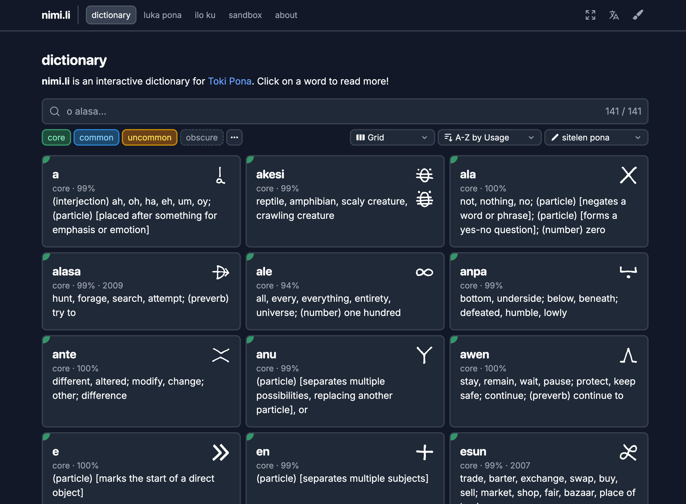
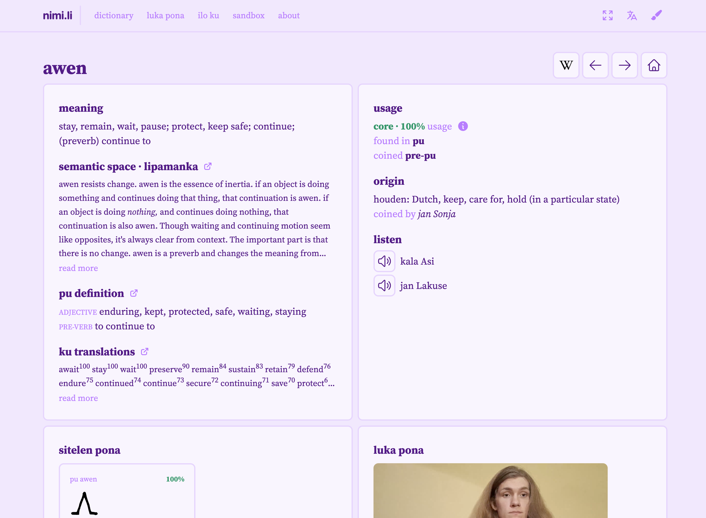
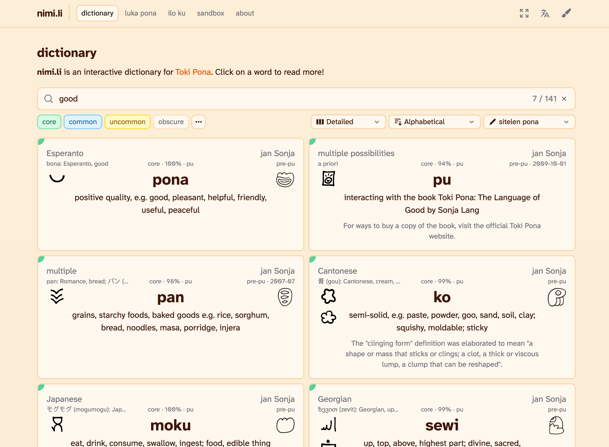
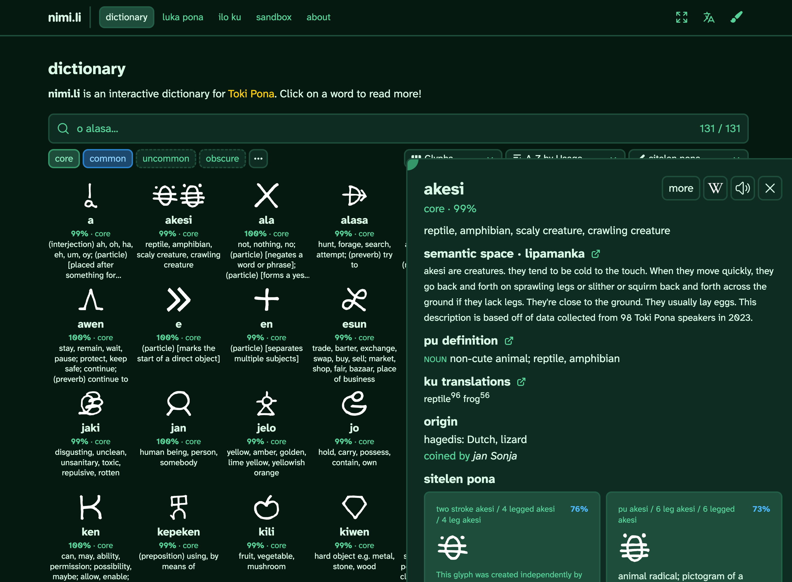
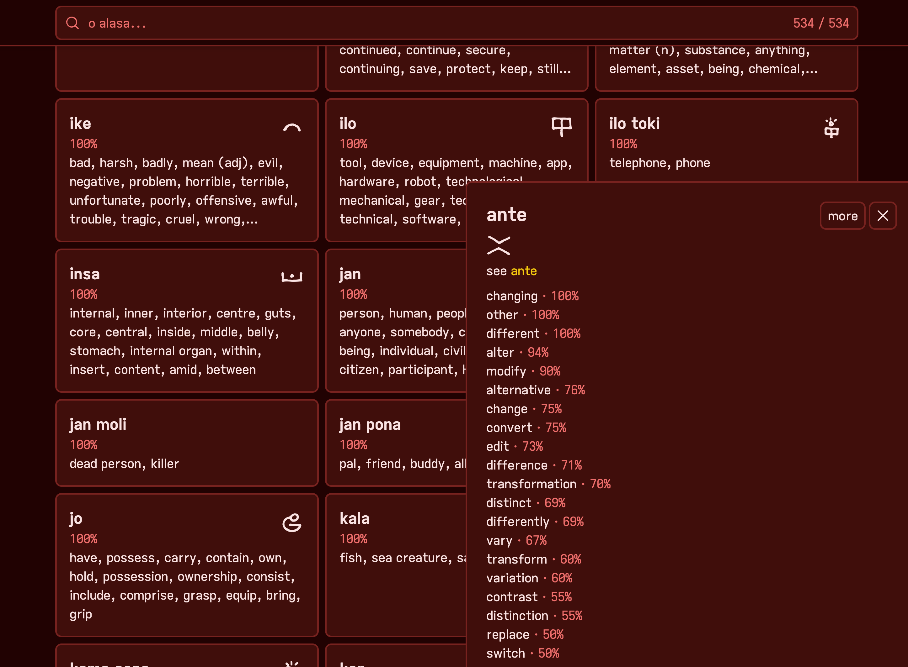
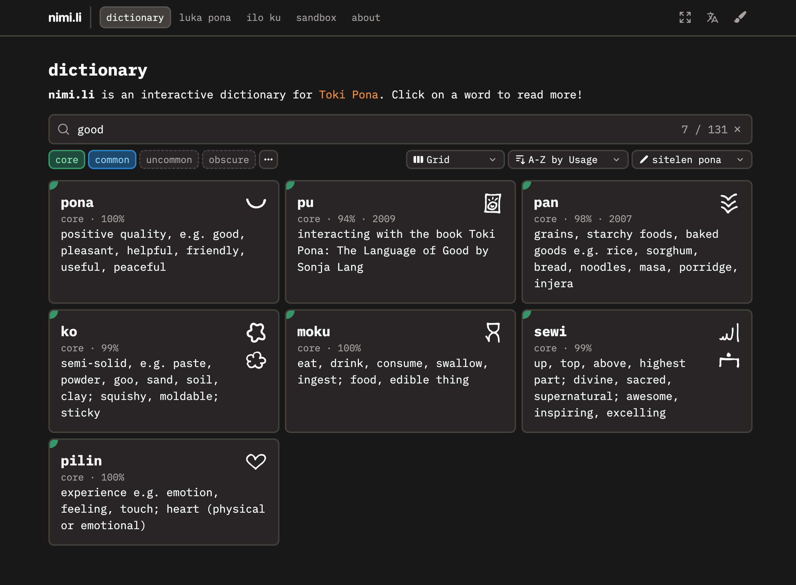

# nimi.li &ndash; Toki Pona Dictionary

[**nimi.li**](https://nimi.li) is an interactive dictionary for the constructed language [Toki Pona](https://tokipona.net), using data from [sona Linku](https://linku.la/about/) and the [public subset of _Toki Pona Dictionary_](https://tokipona.org/compounds.txt).

<!-- |                                       |                                       |                                       |
| :-----------------------------------: | :-----------------------------------: | :-----------------------------------: |
|  |  |  |
|  |  |  |
|                                       |                                       |                                       | -->

<table>
    <tr>
        <td></td>
        <td></td>
        <td></td>
    </tr>
    <tr>
        <td></td>
        <td></td>
        <td></td>
    </tr>
</table>

Use a link like [nimi.li/pona](https://nimi.li/pona) to view a specific word! The link will create an embed with the definition in Discord and any platform that supports showing page metadata.

You can install _nimi.li_ as a Progressive Web App. Thanks _[woflydev](https://github.com/woflydev)_!
